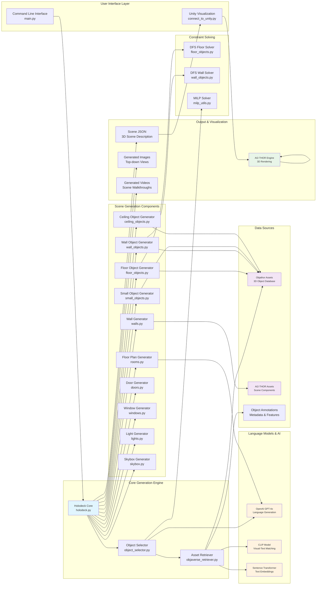

# Holodeck Architecture Overview

## System Architecture Diagram

## Architecture Overview

The Holodeck system is a language-guided 3D embodied AI environment generation platform with the following key architectural layers:

### 1. **User Interface Layer**
- **Command Line Interface**: Entry point for scene generation (`main.py`)
- **Unity Visualization**: Connects generated scenes to Unity for 3D visualization (`connect_to_unity.py`)

### 2. **Core Generation Engine**
- **Holodeck Core**: Main orchestrator that coordinates the entire generation pipeline
- **Object Selector**: Intelligent selection and placement of objects using constraint solving
- **Asset Retriever**: Retrieves and matches 3D assets from object databases

### 3. **Language Models & AI**
- **OpenAI GPT-4o**: Generates floor plans, object lists, and scene descriptions from natural language
- **CLIP Model**: Matches text descriptions to visual assets for object retrieval
- **Sentence Transformer**: Creates embeddings for semantic similarity matching

### 4. **Scene Generation Components**
A modular set of specialized generators for different scene elements:
- **Floor Plan Generator**: Creates room layouts from text descriptions
- **Wall/Floor/Ceiling Generators**: Generate structural elements
- **Object Generators**: Place furniture, decorations, and interactive objects
- **Door/Window Generators**: Add architectural features
- **Lighting/Skybox**: Handle environmental elements

### 5. **Constraint Solving**
- **DFS Solvers**: Depth-first search algorithms for object placement optimization
- **MILP Solver**: Mixed Integer Linear Programming for complex spatial constraints

### 6. **Data Sources**
- **Objathor Assets**: Large database of 3D objects with metadata
- **AI2-THOR Assets**: Scene components and materials
- **Annotations**: Rich metadata for object properties and relationships

### 7. **Output & Visualization**
- **Scene JSON**: Structured 3D scene descriptions
- **Generated Media**: Images and videos of created environments
- **AI2-THOR Integration**: Real-time 3D rendering and interaction

The system transforms natural language descriptions (e.g., "a cozy living room") into fully realized 3D environments through a sophisticated pipeline that combines large language models, computer vision, constraint solving, and 3D graphics.
